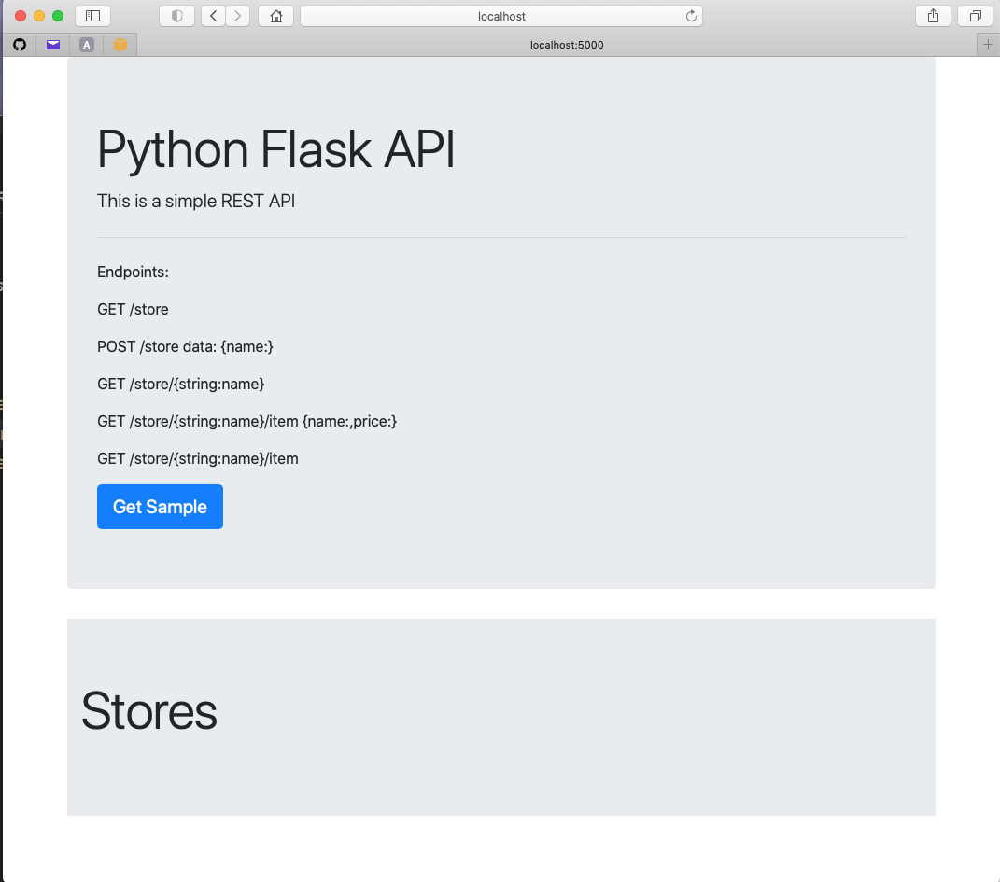

# Python Flask API
## This is a simple REST API


Create a Docker image for Flask API:

````
docker build -t flaskapi .
````

Launch a flaskapi deployment:

``````
docker run -d -p 80:5000 --name flaskapi flaskapi:xxx
``````
Launch web browser type URL: 
http://localhost:5000

 


Endpoints:
``````
GET /store

POST /store data: {name:}

GET /store/{string:name}

GET /store/{string:name}/item {name:,price:}

GET /store/{string:name}/item


